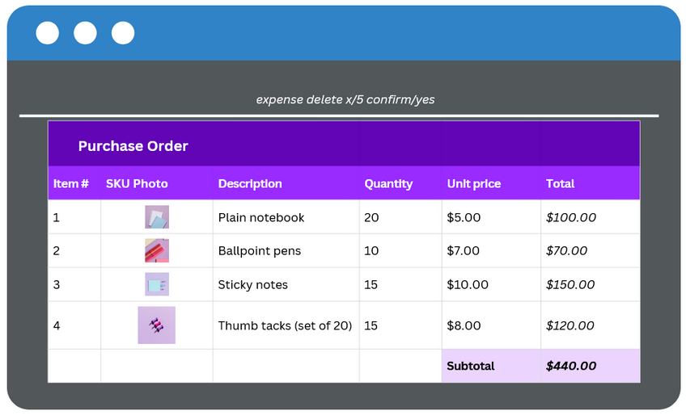

# Team W11-2 — Treasura (Early Prototype)

[](https://github.com/AY2526S1-CS2103T-W11-2/tp/actions)

---



*Figure: Single mockup/screenshot of **Treasura**.*

---

## Overview

**Treasura** is a desktop, **CLI-first** app that streamlines the workflow of **CCA treasurers**: add and manage members, record and review payments, and track simple expenses quickly and reliably.

### Goals (early stage)

- **Fast keyboard-centric flow** for data entry and lookup.
- **Clean membership registry**: add/search/view members, archive inactive members.
- **Lightweight bookkeeping**: record payments, see outstanding amounts, add/delete expenses; payments are shown **chronologically** in the UI.
- **Automatic syncing** after successful changes (no manual backups).

> We are still iterating—commands and UI may evolve.

* This is **a sample project for Software Engineering (SE) students **.<br>
  Example usages:
  * as a starting point of a course project (as opposed to writing everything from scratch)
  * as a case study
  * assist CCA treasurers to keep track of finances
  * access member details 
* The project simulates an ongoing software project for a desktop application (called _Treasura_) used for managing CCA finance details.
  * It is **written in OOP fashion**. It provides a **reasonably well-written** code base **bigger** (around 6 KLoC) than what students usually write in beginner-level SE modules, without being overwhelmingly big.
  * It comes with a **reasonable level of user and developer documentation**.
* It is named `Treasura` because it was initially created to assist CCA treasures in keeping track of finances and member expenses.
* For the detailed documentation of this project, see the **[Address Book Product Website](https://se-education.org/addressbook-level3)**.
* This project is a **part of the se-education.org** initiative. If you would like to contribute code to this project, see [se-education.org](https://se-education.org/#contributing-to-se-edu) for more info.
---

## Early Command Sketch (subject to change)

```bash
# Add member
# Adds a new member. On success, Treasura prints a single-line confirmation with all stored fields,
# including an auto-assigned ID.
member add n/NAME p/PHONE [e/EMAIL] [dob/YYYY-MM-DD] [matric/YEAR] [r/ROLE] [t/TAG]... [note/NOTE]
# Example:
member add n/Chia Sin Jie p/91234567 e/sj@nus.edu.sg dob/2005-04-18 matric/2024 r/treasurer t/dance t/year1 note/Prefers PayNow

# Find member (by ID or name)
# Displays the full profile. Duplicate names prompt for disambiguation.
find id/<memberId>
find n/<memberName>
# Examples:
find id/M1234
find n/John Tan

# Archive member
# Moves an active member into an archive store and hides them from the default list.
member archive /<memberId>
# Example:
member archive /a1b2c3d4

# Record payment
# Records a payment for a member (by ID or name), storing amount/date/remarks.
# Payments are shown chronologically in the UI; outstanding amounts appear in the profile.
payment add m/<memberId|memberName> amt/AMOUNT [d/YYYY-MM-DD] [r/REMARKS]
# Examples:
payment add m/M1234 amt/20 d/2025-09-01 r/"Membership fee"
payment add m/"John Tan" amt/50 r/"CCA T-shirt"

# View payments (chronological UI)
# No command required; the payments panel lists entries by time automatically.

# Add expense
# Adds a new expense. Expense IDs must be unique.
expense add n/NAME x/ID amt/VALUE d/YYYY-MM-DD [t/TAG]... [note/NOTE]
# Example:
expense add n/Equipment x/123 amt/200.00 d/2025-09-09 t/Sports t/Essential note/"Bought 5 basketballs"

# Delete expense
# Removes an expense by ID. If delete confirmations are enabled, confirm/yes is required.
expense delete x/ID [confirm/yes]
# Example:
expense delete x/303 confirm/yes

# Auto-sync
# After successful state-changing commands (add/edit/delete/archive), data is automatically saved to storage.
