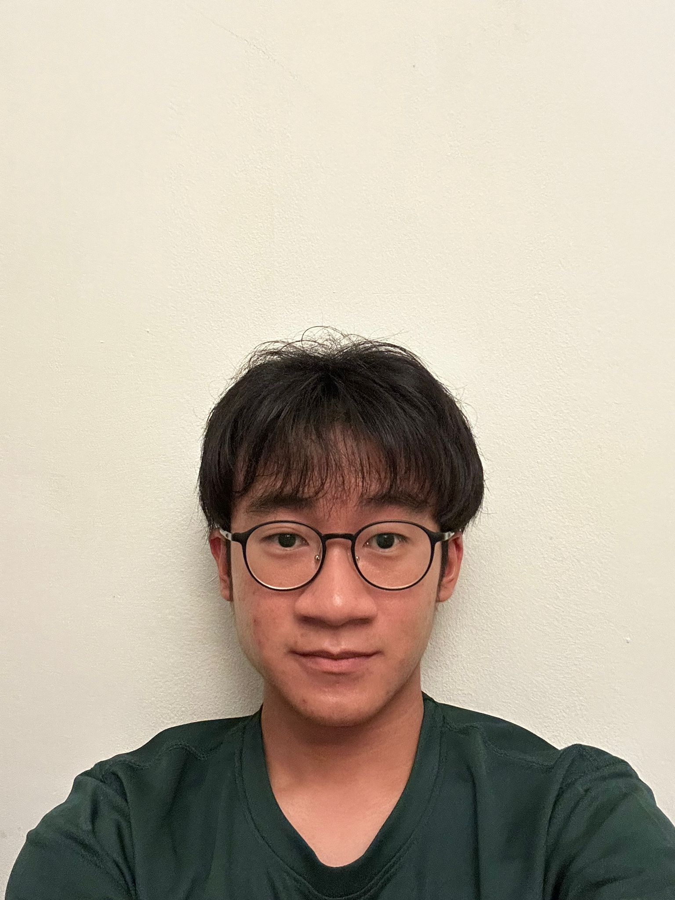
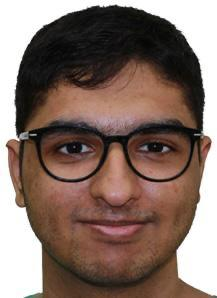
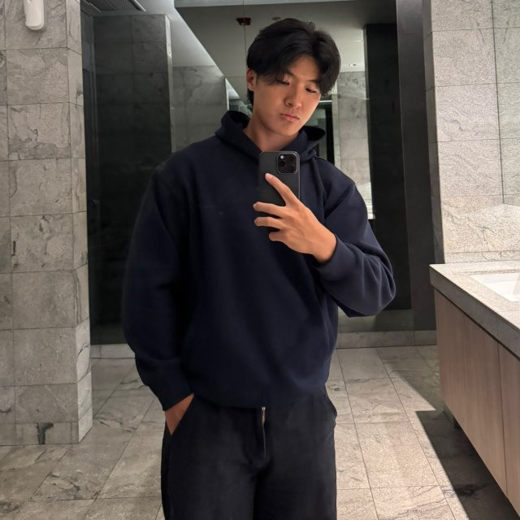

# About Us

We are a team based in the [School of Computing, National University of Singapore](http://www.comp.nus.edu.sg).

You can reach us at the email `seer[at]comp.nus.edu.sg`

## Project team

### Danton Yap

[[github](http://github.com/dnt0n)] [[portfolio](team/dnt0n.md)]

* Role: Developer
* Responsibilities: Data

### Chia Sin Jie 

[[github](http://github.com/sjc)] [[portfolio](team/sjc.md)]

* Role: Developer
* Responsibilities: Data

### Foo Shao Jun

[[github](http://github.com/enamourous)]
[[portfolio](team/enamourous.md)]

* Role: Developer
* Responsibilities: Dev Ops + Threading

### Roshan Kuna

[[github](https://github.com/Roshan1572)]
[[portfolio](team/roshan1572.md)]

* Role: Developer
* Responsibilities: UI

### Jianrong Gu

[[github](http://github.com/jianronggu)]
[[portfolio](team/jianronggu.md)]

* Role: Developer
* Responsibilities: UI
